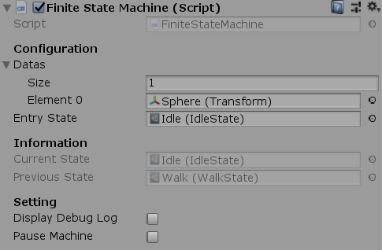
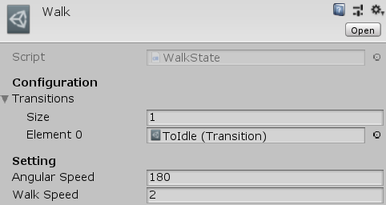
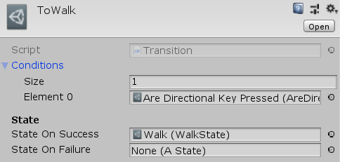

# Unity-Pluggable-Finite-State-Machine

Generic Pluggable Finite State Machine template for Unity3D ;
can be used as it is or adapted to your needs.

Everything is an asset (condition, state and transition) that allow
you to create unique or reusable combination.

An example is provided to show how it works and how
we can create state and condition in the Example/ folder.

*Can be attach with Component --> UniCraft --> PFSM*

# Dependencies

**Unity-Attribute-Collection**: DisableInInspector

# Information

Tested on Unity **2018.3.0b**

Version **1.0.1**

# Screenshots

# License

MIT License